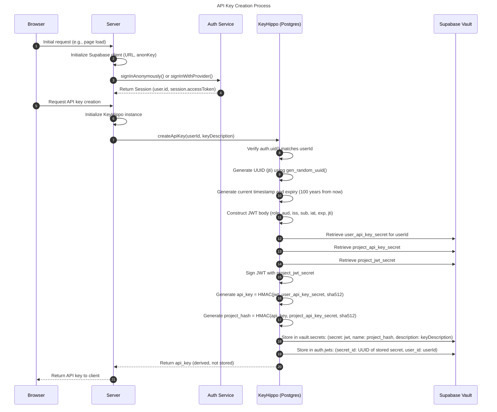
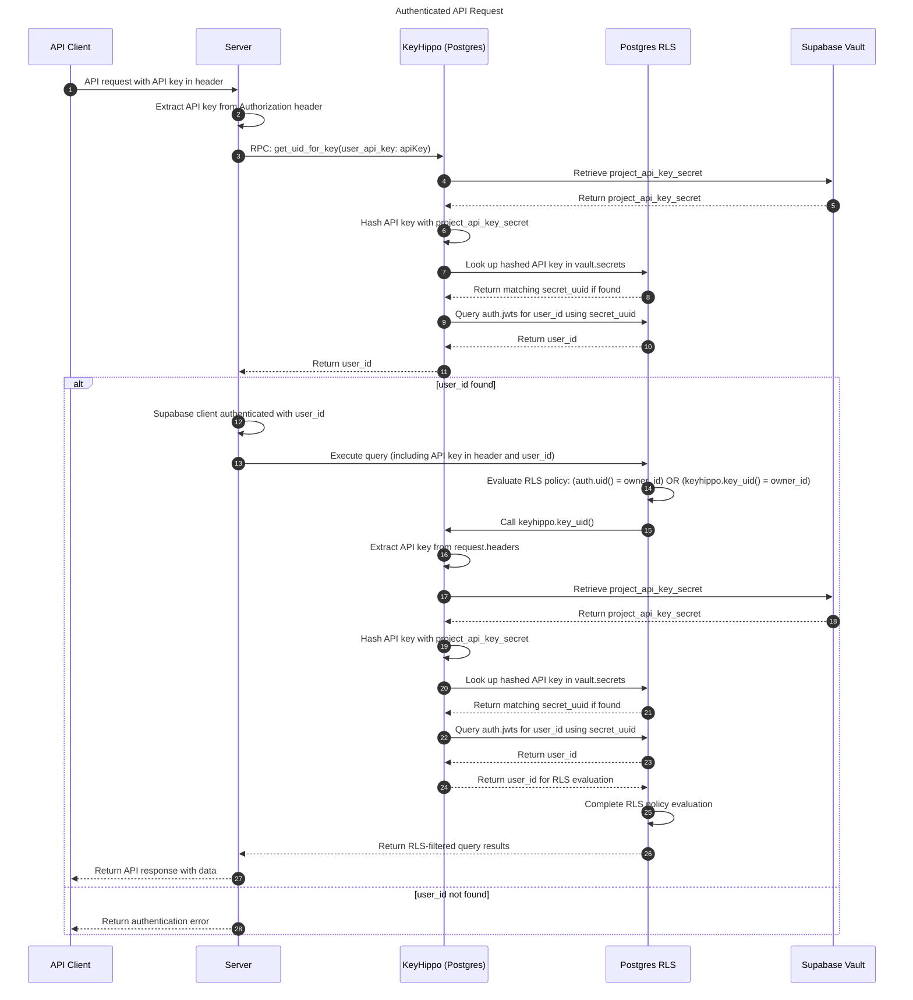

# KeyHippo

KeyHippo extends Supabase's Row Level Security (RLS) framework, enabling seamless integration of API key authentication within existing security policies.

<!-- markdownlint-disable-next-line -->
<div align="center">


[](LICENSE-MIT)
[](https://codecov.io/gh/integrated-reasoning/KeyHippo)
[](https://github.com/marketplace/actions/super-linter)


[](https://nodei.co/npm/keyhippo/)

</div>

## Core Functionality

KeyHippo addresses the challenge of incorporating API key authentication in Supabase applications without compromising the integrity of Row Level Security. It achieves this by extending the RLS framework to encompass both session-based and API key authentication methods within a unified security
context. This approach eliminates the need for parallel security structures and maintains granular access control across authentication types.

Top features:

- Unified RLS policies supporting dual authentication methods
- SQL-based API key issuance
- Preservation of existing Supabase RLS implementations
- Essential API key lifecycle management

## Quick Start

### Database Setup

1. Install the KeyHippo extension:

   ```sql
   select dbdev.install('keyhippo@keyhippo');
   create extension "keyhippo@keyhippo" version '0.0.37';
   ```

   Consult [database.dev](https://database.dev/keyhippo/keyhippo) for version updates.

2. Post-installation, KeyHippo functions become accessible within your database environment.

For more detailed information on the PostgreSQL extension, see the [extension readme](/extension/README.md).

### Application Integration

Install via npm:

```bash
npm install keyhippo
```

For more information on the npm package, including usage examples, see the [client readme](/client/README.md).

## Usage Examples

### API Key Generation

```typescript
import { KeyHippo } from "keyhippo";

const keyHippo = new KeyHippo(supabaseClient);
const result = await keyHippo.createApiKey(userId, "Primary API Key");
```

### RLS Policy Implementation

Example of a policy supporting dual authentication:

```sql
CREATE POLICY "owner_access"
ON "public"."resource_table"
USING (
  auth.uid() = resource_table.owner_id
  OR auth.keyhippo_check(resource_table.owner_id)
);
```

This policy grants access when the user is authenticated via a session token (`auth.uid()`) or a valid API key associated with the resource owner (`auth.keyhippo_check()`).

### Additional Functionality

- `revokeApiKey`: Invalidate an existing API key
- `loadApiKeyInfo`: Retrieve metadata for existing keys
- `getAllKeyMetadata`: Comprehensive metadata for a user's API keys

For more detailed usage instructions and API reference, please see the [documentation](/docs/README.md).

## Architecture

### API Key Creation Process

KeyHippo ensures that API keys are never stored in any form and cannot be reconstructed, even with access to the database.



This design offers several key security benefits:

- **Unique Key Generation:** Each invocation of `keyhippo.create_api_key` produces a distinct key, regardless of input consistency.
- **Temporal Uniqueness:** The use of high-precision timestamps ensures that keys created in rapid succession remain unique.
- **Cryptographic Irreversibility:** The multi-stage hashing process renders the key generation process cryptographically irreversible.
- **Breach Resilience:** In the event of a database compromise, the stored hashes provide no mechanism to regenerate or deduce the original API keys.
- **Separation of Concerns:** The utilization of Supabase Vault for secret management adds an additional layer of security.

### Authenticated API Request Flow

This diagram illustrates the sequence of operations that occur when an API request is made using a KeyHippo-generated API key:



Note the seamless integration of KeyHippo's authentication process with Supabase's existing RLS framework. This approach ensures that API key authentication adheres to the same security policies as session-based authentication, maintaining a consistent security model across different authentication methods.

For more detailed architectural information, please see the [Architecture documentation](/docs/Architecture.md).

## Alpha Status

KeyHippo is currently in alpha status. We adhere to semantic versioning, and as such, KeyHippo will remain in alpha (versions < 0.1.0) until we've thoroughly validated its stability and feature completeness in production environments. During this phase, we welcome early adopters to provide feedback and report issues.

## Origins and Evolution

KeyHippo emerged from a pattern observed across Integrated Reasoning's Supabase projects: the need to reconcile API key authentication with Row Level Security policies. This challenge, also noted in Supabase's GitHub discussions (#4419), highlighted a gap in existing solutions.

We developed KeyHippo to address this, drawing insights from community discussions and approaches. The result is a streamlined, production-ready system for API key management in Supabase applications.

## Contribution

KeyHippo welcomes community contributions. For guidance on contributing, please refer to our [Contributing Guide](/docs/Contributing.md).

## Licensing

KeyHippo is distributed under the MIT license. See the [LICENSE](LICENSE) file for details.

## Support Channels

For technical issues, feature requests, or general inquiries, please open an issue on our [GitHub repository](https://github.com/integrated-reasoning/KeyHippo/issues).

For commercial support options, consult [keyhippo.com](https://keyhippo.com).

## Additional Documentation

- [Installation Guide](/docs/Installation.md)
- [Usage Guide](/docs/Usage.md)
- [API Reference](/docs/API-Reference.md)
- [Security Considerations](/docs/Security.md)
- [Changelog](/docs/Changelog.md)
- [Advanced RLS Integration](/docs/advanced/RLS-Integration.md)
- [Performance Optimization](/docs/advanced/Performance-Optimization.md)
