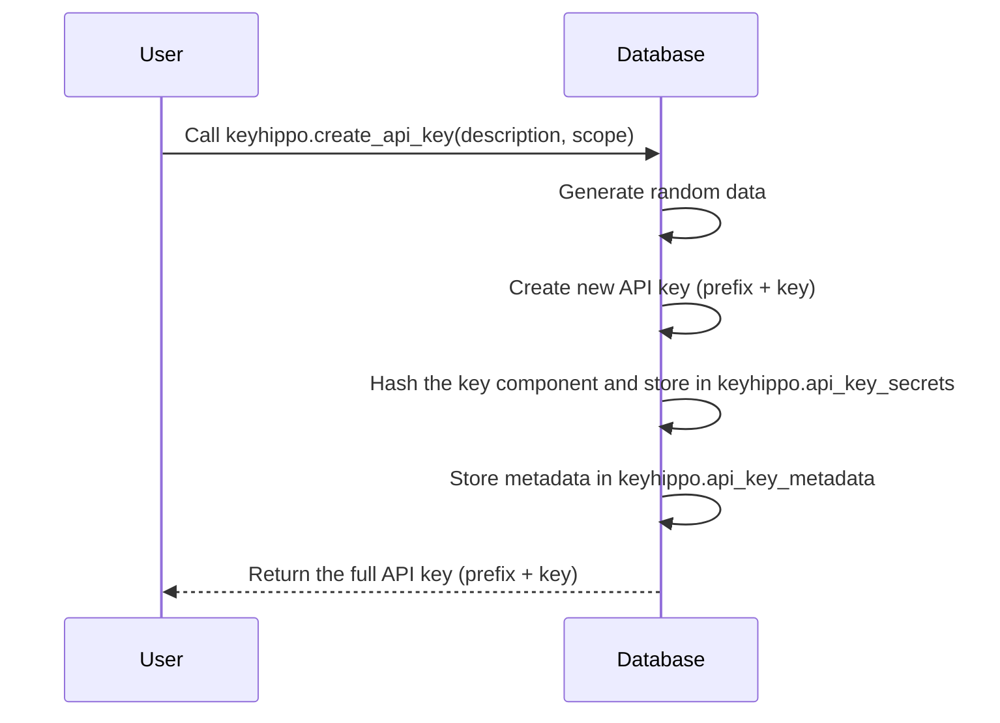

# KeyHippo

KeyHippo extends Supabase's Row Level Security (RLS) to support API key authentication and Role-Based Access Control (RBAC) directly in Postgres.

<!-- markdownlint-disable-next-line -->
<div align="center">


[](LICENSE-MIT)
[](https://github.com/marketplace/actions/super-linter)

</div>

## Core Functionality

KeyHippo enables API key authentication and fine-grained access control in Supabase applications while preserving Row Level Security policies. It handles both session-based and API key authentication using SQL and introduces an RBAC system for managing permissions.

Features:

- Unified RLS policies for session and API key authentication
- Secure API key management without JWTs
- Role-Based Access Control (RBAC) for permissions
- Impersonation functions for administrative tasks
- API key lifecycle management

## Quick Start

### Database Setup

1. Install the KeyHippo extension:

```sql
select dbdev.install('keyhippo@keyhippo');
create extension "keyhippo@keyhippo" version '0.0.42';
```

Consult [database.dev](https://database.dev/keyhippo/keyhippo) for version updates.

2. Post-installation, KeyHippo functions become accessible within your database environment.

## Application Integration

KeyHippo functions are accessible via SQL. Use them directly in your application code or via PostgREST. All interactions with KeyHippo occur through your application's existing database interface.

## Usage Examples

### API Key Generation

Create an API key for the current authenticated user:

```sql
SELECT * FROM keyhippo.create_api_key('Primary API Key', 'default');
```

This generates a new API key with the provided description and associates it with the 'default' scope.

### RLS Policy Implementation

Example of a policy supporting both authentication methods and RBAC:

```sql
CREATE POLICY "owner_access"
ON "public"."resource_table"
FOR SELECT
USING (
  keyhippo.current_user_context().user_id = resource_table.owner_id
  AND keyhippo.authorize('manage_resources')
);
```

This policy grants access when the user is authenticated via a session token or a valid API key and has the 'manage_resources' permission.

### RBAC Management

Create a new group, role, and assign permissions:

```sql
-- Create a new group
SELECT keyhippo_rbac.create_group('Developers', 'Group for developer users') AS group_id;

-- Create a new role
SELECT keyhippo_rbac.create_role('Developer', 'Developer role', '<group_id>', 'user') AS role_id;

-- Assign permissions to the role
SELECT keyhippo_rbac.assign_permission_to_role('<role_id>', 'manage_resources');

-- Assign the role to a user
SELECT keyhippo_rbac.assign_role_to_user('<user_id>', '<group_id>', '<role_id>');
```

### Impersonation Functionality

Admins can impersonate other users for administrative purposes:

```sql
-- Login as another user (requires postgres role)
CALL keyhippo_impersonation.login_as_user('<user_id>');

-- Perform actions as the impersonated user

-- Logout of impersonation
CALL keyhippo_impersonation.logout();
```

## Architecture

### API Key Mechanism

KeyHippo generates API keys using high-entropy random data. API keys are not stored in plaintext; only their hashes are stored in the database. Even if the database is compromised, the API keys cannot be reconstructed.

**Key Points:**

- **Unique Key Generation:** Each API key is generated using secure random data to ensure uniqueness.
- **No Plaintext Storage:** Only the hash of the key component is stored; the plaintext key is available only upon creation.
- **Prefix Usage:** A prefix identifies keys without exposing the full key.
- **Secure Verification:** API keys are verified by hashing the provided key component and comparing it to the stored hash.

**API Key Creation Process:**



## Role-Based Access Control (RBAC)

KeyHippo provides an RBAC system, allowing you to define groups, roles, and permissions. This system integrates with Supabase's RLS policies, enabling fine-grained access control over your application's resources.

### RBAC Components

- **Groups:** Logical grouping of users.
- **Roles:** Assigned to users within groups, defining their role type ('admin', 'user').
- **Permissions:** Specific actions that can be granted to roles.
- **Role Permissions:** Association between roles and permissions.
- **User Group Roles:** Association between users, groups, and roles.

## Impersonation

KeyHippo offers impersonation functionality for administrators. This allows admins to act on behalf of other users, useful for troubleshooting and support tasks.

### Impersonation Process

- **Login as User:** Use keyhippo_impersonation.login_as_user(user_id) to impersonate a user.
- **Session Management:** The impersonation session is tracked, and the original role is stored.
- **Logout:** End the impersonation session with keyhippo_impersonation.logout().

### Integration with RLS

KeyHippo's authentication and authorization integrate with Supabase's Row Level Security policies. Use the keyhippo.current_user_context() function to retrieve the current user's ID, scope, and permissions within your RLS policies.

**Example RLS Policy:**

```sql
CREATE POLICY "user_can_view_own_data" ON "public"."user_data"
  FOR SELECT USING (
    keyhippo.current_user_context().user_id = user_data.user_id
    AND keyhippo.authorize('view_data')
  );
```

## Contribution

We welcome community contributions. For guidance, see our Contributing Guide.

## Licensing

KeyHippo is distributed under the MIT license. See the LICENSE file for details.

## Support Channels

For technical issues or feature requests, open an issue on our GitHub repository.

For commercial support options, visit [keyhippo.com](https://keyhippo.com).
