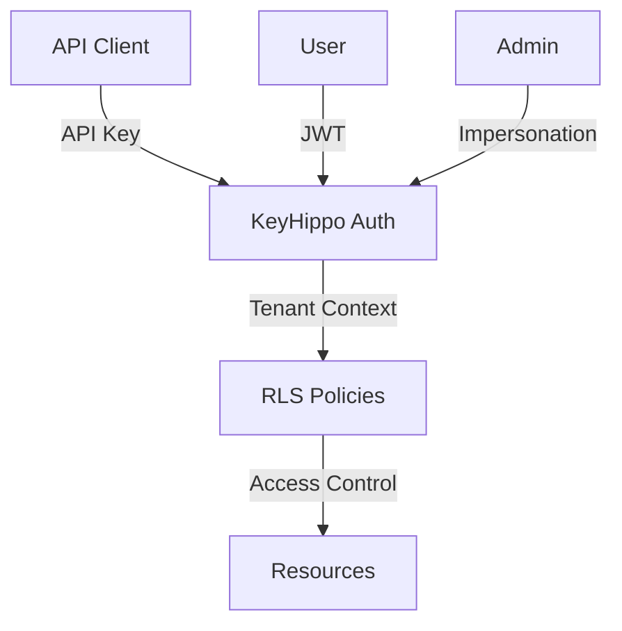

# Enterprise QuickStart Guide

Implementation guide for setting up KeyHippo in a multi-tenant enterprise environment.

## Prerequisites

- PostgreSQL 14 or higher
- Supabase Enterprise or self-hosted setup
- Database superuser access
- Basic understanding of RBAC concepts

## Architecture Overview



## Installation

1. Install dependencies:
```sql
CREATE EXTENSION IF NOT EXISTS pgcrypto;
CREATE EXTENSION IF NOT EXISTS pg_net;
CREATE EXTENSION IF NOT EXISTS pg_cron;
```

2. Install KeyHippo:
```sql
\i sql/keyhippo.sql
```

## Tenant Setup

1. Create tenant tables:
```sql
CREATE TABLE tenants (
    id uuid PRIMARY KEY DEFAULT gen_random_uuid(),
    name text NOT NULL,
    settings jsonb DEFAULT '{}',
    created_at timestamptz DEFAULT now()
);

CREATE TABLE tenant_members (
    tenant_id uuid REFERENCES tenants(id) ON DELETE CASCADE,
    user_id uuid REFERENCES auth.users(id) ON DELETE CASCADE,
    role text NOT NULL,
    PRIMARY KEY (tenant_id, user_id)
);
```

2. Enable RLS:
```sql
ALTER TABLE tenants ENABLE ROW LEVEL SECURITY;
ALTER TABLE tenant_members ENABLE ROW LEVEL SECURITY;
```

## RBAC Configuration

1. Create tenant-specific groups:
```sql
DO $$
DECLARE
    tenant_group_id uuid;
BEGIN
    -- Create tenant admin group
    SELECT keyhippo_rbac.create_group(
        'Tenant Administrators',
        'Tenant-level administrative access'
    ) INTO tenant_group_id;
    
    -- Create admin role
    PERFORM keyhippo_rbac.create_role(
        'Tenant Admin',
        'Full tenant access',
        tenant_group_id,
        'admin'
    );
END $$;
```

2. Set up permissions:
```sql
-- Add tenant management permissions
INSERT INTO keyhippo_rbac.permissions (name, description)
VALUES 
    ('tenant:admin', 'Full tenant access'),
    ('tenant:member', 'Basic tenant access'),
    ('tenant:read', 'Read-only tenant access');
```

## Access Control Implementation

1. Create tenant access function:
```sql
CREATE OR REPLACE FUNCTION public.has_tenant_access(tenant_id uuid)
RETURNS boolean
LANGUAGE plpgsql
SECURITY DEFINER
SET search_path = public, private, keyhippo
AS $$
DECLARE
    ctx record;
    key_data jsonb;
BEGIN
    -- Get authentication context
    SELECT * INTO ctx FROM keyhippo.current_user_context();
    
    -- Check direct membership
    IF EXISTS (
        SELECT 1 FROM tenant_members
        WHERE user_id = ctx.user_id
        AND tenant_id = $1
    ) THEN
        RETURN true;
    END IF;
    
    -- Check API key claims
    key_data := keyhippo.key_data();
    RETURN (
        key_data IS NOT NULL AND
        (key_data->'claims'->>'tenant_id')::uuid = $1
    );
END;
$$;
```

2. Apply RLS policies:
```sql
-- Tenant access policy
CREATE POLICY tenant_access_policy ON tenants
    FOR ALL TO authenticated, anon
    USING (has_tenant_access(id));

-- Resource policy template
CREATE POLICY resource_tenant_policy ON resource_table
    FOR ALL TO authenticated, anon
    USING (has_tenant_access(tenant_id));
```

## API Key Management

1. Create tenant-specific API key:
```sql
CREATE OR REPLACE FUNCTION create_tenant_api_key(
    tenant_id uuid,
    description text
) RETURNS text
LANGUAGE plpgsql
SECURITY DEFINER
AS $$
DECLARE
    key_record record;
BEGIN
    -- Verify tenant access
    IF NOT has_tenant_access(tenant_id) THEN
        RAISE EXCEPTION 'Unauthorized';
    END IF;

    -- Create API key
    SELECT * INTO key_record FROM keyhippo.create_api_key(
        description,
        'tenant'
    );
    
    -- Add tenant claim
    PERFORM keyhippo.update_key_claims(
        key_record.api_key_id,
        jsonb_build_object(
            'tenant_id', tenant_id,
            'created_at', now()
        )
    );
    
    RETURN key_record.api_key;
END;
$$;
```

## Monitoring Setup

1. Enable audit logging:
```sql
-- Update configuration
INSERT INTO keyhippo_internal.config (key, value)
VALUES 
    ('enable_audit_logging', 'true'),
    ('audit_retention_days', '90');
```

2. Create audit views:
```sql
CREATE VIEW tenant_audit_log AS
SELECT 
    a.*,
    (a.data->'claims'->>'tenant_id')::uuid as tenant_id
FROM keyhippo.audit_log a
WHERE a.data ? 'tenant_id';
```

## Security Hardening

1. Configure key expiration:
```sql
-- Set default key expiration to 90 days
UPDATE keyhippo_internal.config
SET value = '90'
WHERE key = 'key_expiry_notification_hours';
```

2. Enable automatic key rotation:
```sql
SELECT cron.schedule(
    'rotate-tenant-keys',
    '0 0 * * 0',
    $$
    SELECT rotate_expired_tenant_keys();
    $$
);
```

## Testing Setup

1. Create test tenant:
```sql
DO $$
DECLARE
    tenant_id uuid;
    test_user_id uuid;
BEGIN
    -- Create test tenant
    INSERT INTO tenants (name)
    VALUES ('Test Tenant')
    RETURNING id INTO tenant_id;
    
    -- Create test user
    SELECT id INTO test_user_id
    FROM auth.users
    WHERE email = 'test@example.com';
    
    -- Add membership
    INSERT INTO tenant_members (tenant_id, user_id, role)
    VALUES (tenant_id, test_user_id, 'admin');
END $$;
```

2. Verify setup:
```sql
-- Create test API key
SELECT create_tenant_api_key(
    'tenant_id_here',
    'Test API Key'
);

-- Test access
SELECT has_tenant_access('tenant_id_here');
```

## Next Steps

- Implement [Custom Claims](../api/functions/update_key_claims.md)
- Set up [Key Rotation](api_key_patterns.md#key-rotation)
- Configure [Audit Logging](../api/tables/audit_log.md)

## Related Resources

- [Multi-Tenant Guide](multi_tenant.md)
- [API Key Patterns](api_key_patterns.md)
- [Security Best Practices](../api/security/rls_policies.md)